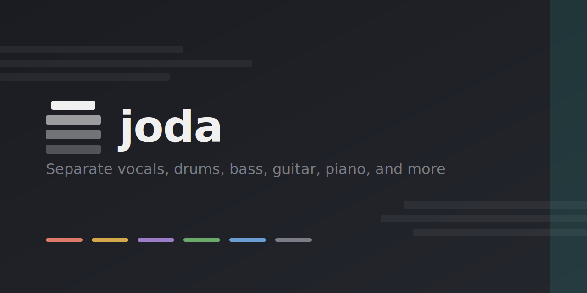
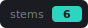
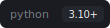
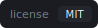
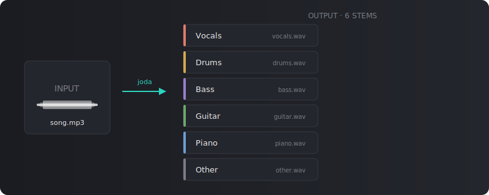

<p align="center">
  
</p>

<p align="center">
  
  
  
</p>

<p align="center">
  Audio stem separation — isolate vocals, drums, bass, guitar, piano, and more from any song,
  then mix each part live in a synced browser mixer.
</p>

---

## How it works

<p align="center">
  
</p>

joda separates a mixed track into six individual stems using
[Demucs](https://github.com/adefossez/demucs) (`htdemucs_6s`) running **locally** — no cloud,
no API key. Each stem is decoded into the Web Audio API and played back from a single shared
clock, so muting, soloing, and adjusting volume never breaks sync. Bounce the current mix back
out to a WAV at any time.

```
frontend/index.html    Single-page studio UI: drag-drop upload + Web Audio stem mixer + WAV export
backend/app.py          FastAPI: validate upload -> enqueue job -> poll status -> stem URLs
backend/worker.py       RQ task: runs demucs in a separate process, reports live progress
backend/queue.py        Shared Redis connection + RQ queue
backend/storage.py      Blob store abstraction: local disk or S3/R2/GCS/minio (presigned URLs)
backend/config.py       Env-driven settings (JODA_* / .env)
backend/cache.py        Result cache: dedupe identical uploads by content hash
backend/ratelimit.py    Per-client fixed-window rate limiting (Redis)
backend/observability.py  Structured JSON logging, Sentry, Prometheus /metrics
backend/cleanup.py      TTL sweeper for old uploads + stems (local + S3)
Dockerfile / docker-compose.yml   Full stack: web + worker + redis + minio
docker-compose.gpu.yml  Override: run workers on NVIDIA GPU
.github/workflows/ci.yml  CI: ruff lint + pytest + docker build
```

Separation runs **asynchronously**: the upload endpoint stores the file in the
blob store and enqueues a job, a worker process runs Demucs off a Redis queue
and uploads stems back to the store, and the browser polls for progress. This
keeps the web server responsive and lets you scale throughput by running more
workers (on GPU boxes for a large speedup).

> **Note on guitar:** `htdemucs_6s` emits a single `guitar` stem. Splitting a guitar track into
> *lead* vs. *rhythm* is a musical role, not an instrument class — no open-source (or current
> cloud) model does it reliably, so it is out of scope.

## Run

### Docker (recommended)

The whole stack — web + worker + Redis + minio (S3-compatible object store) —
comes up with one command:

```bash
docker compose up --build
```

Open <http://localhost:8000> (minio console: <http://localhost:9001>,
`minioadmin`/`minioadmin`). Scale workers for more throughput:

```bash
docker compose up --scale worker=3
```

The image bakes in ffmpeg and the `htdemucs_6s` weights, so containers start
fast and don't each re-download the model.

### Local (no Docker)

Runs as **two processes** plus Redis. Start Redis first, then:

```bash
# macOS: brew install ffmpeg redis && brew services start redis
python3 -m venv .venv
.venv/bin/pip install -r requirements.txt

# terminal 1 — worker (runs Demucs off the queue; start N of these to scale)
.venv/bin/python -m backend.run_worker

# terminal 2 — web server
.venv/bin/uvicorn backend.app:app --port 8000
```

Open <http://localhost:8000>, drop in a song, watch the progress bar as the
worker separates it, then play, solo/mute, mix, and **Export** the result.
Local mode defaults to disk storage; the first run downloads the model weights
to `~/.cache/torch` (cached thereafter).

### Configuration

All settings are overridable via `JODA_*` env vars or a `.env` file (copy
[`.env.example`](./.env.example)) — see [`backend/config.py`](./backend/config.py).
Useful ones:

| Env var | Default | Purpose |
|---------|---------|---------|
| `JODA_DEVICE` | *(auto/CPU)* | Set `cuda` or `mps` to run Demucs on GPU |
| `JODA_STORAGE_BACKEND` | `local` | `local` (disk) or `s3` (S3/R2/GCS/minio) |
| `JODA_S3_ENDPOINT_URL` | *(AWS)* | S3 endpoint (e.g. `http://minio:9000`) |
| `JODA_S3_PUBLIC_ENDPOINT_URL` | *(=endpoint)* | Browser-reachable host for presigned URLs |
| `JODA_MAX_UPLOAD_BYTES` | `104857600` (100 MB) | Reject larger uploads |
| `JODA_ARTIFACT_TTL` | `21600` (6h) | Auto-delete artifacts older than this |
| `JODA_CACHE_ENABLED` | `true` | Dedupe identical uploads (skip re-separation) |
| `JODA_RATE_LIMIT_PER_MIN` | `10` | Per-IP cap on `/api/separate` (0 disables) |
| `JODA_REDIS_URL` | `redis://localhost:6379/0` | Queue backend |
| `JODA_SENTRY_DSN` | *(disabled)* | Error tracking |

With `s3`, stems are served to the browser via **presigned URLs** (downloads
bypass the app). Run the TTL sweeper on a schedule (cron / systemd / k8s CronJob):

```bash
.venv/bin/python -m backend.cleanup   # or: docker compose run --rm web cleanup
```

### Tests

```bash
.venv/bin/pip install -r requirements-dev.txt
.venv/bin/python -m pytest backend/tests -q   # Demucs subprocess is mocked
```

## Usage

1. **Drop a track** onto the upload zone (`mp3 · wav · flac · ogg · m4a`).
2. joda runs Demucs and loads the six stems into the mixer.
3. **Mix live** — mute (`M`), solo (`S`), and set each stem's volume. Playback stays
   sample-locked across all stems.
4. **Export** — bounce the current mix (exactly what you hear, with mute/solo/volume applied)
   to a downloadable WAV, rendered client-side.

## Output

| Stem | Description | File |
|------|-------------|------|
| Vocals | Lead vocals, backing vocals, spoken word | `vocals.wav` |
| Drums | Drums, percussion, cymbals | `drums.wav` |
| Bass | Bass guitar, synth bass, sub bass | `bass.wav` |
| Guitar | Electric guitar, acoustic guitar | `guitar.wav` |
| Piano | Piano, keys, synths | `piano.wav` |
| Other | Everything else (strings, FX, …) | `other.wav` |

## API

The backend exposes a small HTTP API (see [`backend/app.py`](./backend/app.py)):

| Method | Path | Purpose |
|--------|------|---------|
| `POST` | `/api/separate` | Multipart audio upload → validates, enqueues a job → `202 { job_id, status }` |
| `GET`  | `/api/jobs/{job_id}` | Poll job status → `{ status, progress, stems?, error? }` (stems are app routes or presigned S3 URLs) |
| `GET`  | `/api/stems/{job_id}/{stem}.wav` | Serve a stem (local backend; S3 uses presigned URLs) |
| `GET`  | `/healthz` · `/readyz` | Liveness / readiness (readiness checks Redis) |
| `GET`  | `/metrics` | Prometheus metrics |

## Requirements

- Python 3.12
- FFmpeg (for audio decoding)
- Redis (job queue)
- Object store for production (S3/R2/GCS/minio); local disk works for dev
- 4GB+ RAM recommended
- GPU optional — set `JODA_DEVICE=cuda` (or `mps` on Apple Silicon) for a large speedup

## Status / next steps

**Phase 1 (robustness)** ✅ — async job queue + progress, input hardening
(size cap, magic-byte sniff, subprocess timeout, job-id validation), TTL
cleanup, health probes, pinned deps, tests.

**Phase 2 (deployable)** ✅ — object storage (local/S3 with presigned URLs),
Dockerfile + docker-compose (web + worker + redis + minio, weights baked in),
structured JSON logging, Sentry hook, Prometheus `/metrics`.

**Phase 3 (scale)** ✅ — result caching (dedupe identical uploads by content
hash), per-client rate limiting, GPU worker compose profile, CI (ruff + pytest
+ docker build), and a deployment guide ([`DEPLOYMENT.md`](./DEPLOYMENT.md))
covering autoscaling on queue depth and CDN-fronted downloads.

**Modes & export** ✅ — pick **6 stems** (full split) or **2 stems**
(vocals / instrumental, ~2× faster) on upload. Export the live mix as **WAV**
or **MP3** (client-side, 192 kbps via a bundled lamejs).

Possible next steps:

- **Auth / quotas** — API keys with per-key limits (rate limiting is per-IP today).
- **Job history / accounts** — persist past separations instead of losing the job id.
- **FLAC export** — lossless alongside WAV/MP3.

## License

MIT © joda Contributors
